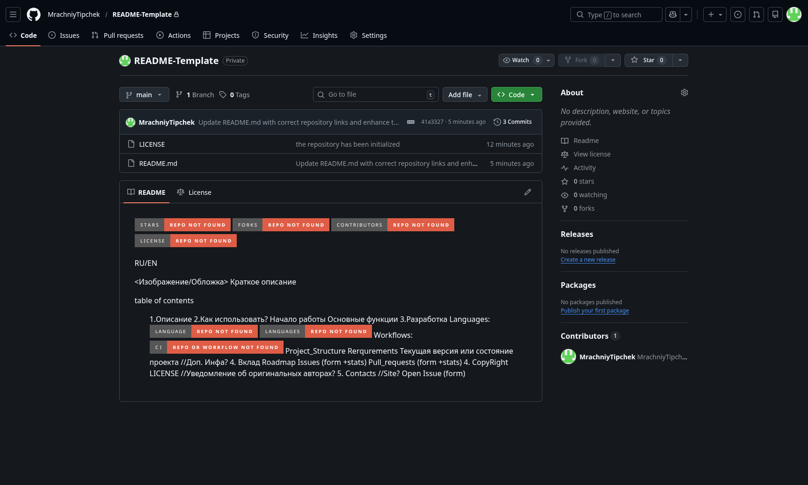

![Stars][stars-shield] ![Forks][forks-shield] ![Contributors][contributors-shield] ![License][license-shield]

[RU](README_RU.md) / EN



Краткое, но привлекательное описание проекта: 1–2 предложения о том, **что делает ваш проект**, **для кого он**, и **какую проблему решает**. Замените этот текст на описание именно вашего репозитория.

---

<details>
  <summary><strong>Оглавление</strong></summary>

- **[Описание](#описание)**
- **[Как использовать](#как-использовать)**
- **[Основные функции](#основные-функции)**
- **[Разработка](#разработка)**
- **[Вклад](#вклад)**
- **[Лицензия](#лицензия)**
- **[Контакты](#контакты)**

</details>

---

## Описание

Здесь напишите основное описание вашего проекта:

- Для чего он?
- Какие задачи решает?
- Для кого предназначен?
- Чем отличается от аналогов?

---

## Как использовать

Опишите как пользователю запустить ваш проект шаг за шагом:

1. Клонируйте репозиторий:

```bash
git clone https://github.com/ВАШ_АККАУНТ/ВАШ_ПРОЕКТ.git
cd ВАШ_ПРОЕКТ
```

2. Установите зависимости:

```bash
pip install -r requirements.txt
```

3. Запустите `main.py`:

```bash
python main.py
```

4. Добавьте сюда следующие шаги, если они нужны для вашего проекта:

```text
4. ...
5. ...
```

---

## Основные функции

Основные функции вашего проекта можно красиво оформить в виде таблицы:

| Функция | Описание |
| --- | --- |
| Функция 1 | Коротко опишите, что делает функция |
| Функция 2 | Коротко опишите, что делает функция |
| Функция 3 | Коротко опишите, что делает функция |

---

## Разработка

```text
images/
  logo.png
LICENSE
README.md
README_RU.md
src/
tests/
```

- ![Languages][languages-shield]
- ![Build status][ci-shield]
- ![Actions tool][actions-tool-shield]

Requierements:

1. Добавьте сюда зависимости для проекта
2. ...

Состояние проекта:

- Статус -
- Последняя версия девбилд -
- Последняя стабильная версия -

---

## Вклад

- ![Open issues][issues-shield]
- ![Open PRs][prs-shield]

---

## Лицензия

Проект распространяется под лицензией **[MIT](LICENSE)**.  
Вы можете свободно использовать, изменять и распространять код в соответствии с условиями лицензии.

Если ваш проект основан на другом репозитории или использует чужой код, добавьте сюда информацию об оригинальных авторах и ссылку на источник.

---

## Контакты

- **Автор**: укажите своё имя или никнейм.
- **GitHub**: ссылка на ваш профиль или организацию.
- **Связь**: добавьте удобный способ связи (email, Telegram, ссылка на форму обратной связи).

Также вы всегда можете оставить вопрос или предложение через вкладку **Issues** в GitHub.

[stars-shield]: https://img.shields.io/github/stars/MrachniyTiphek/README-Template?style=for-the-badge
[forks-shield]: https://img.shields.io/github/forks/MrachniyTiphek/README-Template?style=for-the-badge
[contributors-shield]: https://img.shields.io/github/contributors/MrachniyTiphek/README-Template?style=for-the-badge
[license-shield]: https://img.shields.io/github/license/MrachniyTiphek/README-Template?style=for-the-badge

[languages-shield]: https://img.shields.io/badge/Languages-LANG1%20%7C%20LANG2%20%7C%20LANG3-blue?style=for-the-badge
[ci-shield]: https://img.shields.io/github/actions/workflow/status/MrachniyTiphek/README-Template/WORKFLOW_FILE.yml?style=for-the-badge&label=CI
[actions-tool-shield]: https://img.shields.io/badge/Actions%20tool-TOOL-blueviolet?style=for-the-badge
[prs-shield]: https://img.shields.io/github/issues-pr/MrachniyTiphek/README-Template?style=for-the-badge
[issues-shield]: https://img.shields.io/github/issues/MrachniyTiphek/README-Template?style=for-the-badge